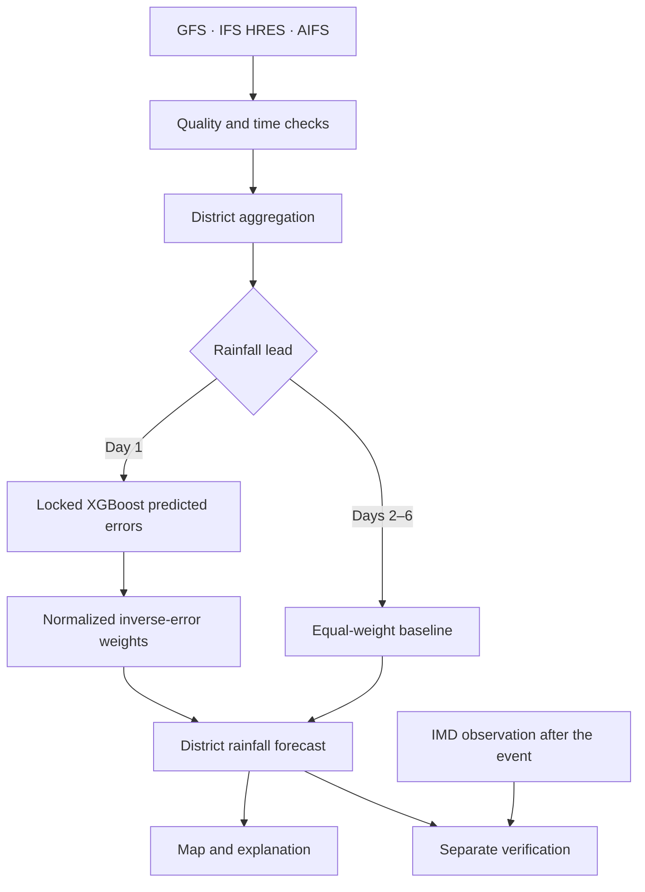

SYNAPSE-WX
Synoptic-Aware Adaptive Weather Intelligence
Multiple models. Adaptive trust. Explainable forecasts.

Smart India Hackathon 2026 · SIH26081 · Hybrid AI–NWP Multi-Model Forecast Blending System · Team HakunaMatata
SYNAPSE-WX is a Karnataka district-level weather intelligence MVP. It combines existing physics-based and AI forecast products, checks their completeness, and makes their contributions visible alongside the rainfall forecast. Its validated adaptive blend is a locked Day-1, three-source XGBoost expected-error model. Days 2–6 currently use labelled equal-weight rainfall baselines.
We do not replace weather models. We estimate how much each source should influence a particular Day-1 rainfall forecast, then show the evidence behind that choice.

1. Problem and solution
GFS, ECMWF IFS HRES, and ECMWF AIFS can disagree. Their errors vary with the forecast situation, while raw model grids, differing time conventions, and incomplete data complicate district-level use. Choosing one source or always averaging them equally does not account for those differences.
SYNAPSE-WX adds quality checks, district aggregation, error-aware Day-1 weighting, a consolidated forecast, and post-event verification. The largest displayed weight means greatest influence for that district, date, and lead according to the locked model. It does not mean that source is universally best, or that the weight is a calibrated probability.
2. What is implemented
Capability	Current status
Karnataka coverage	31 administrative districts and 249 configured sampling points; six complete IST target days per statewide cycle.
Rainfall sources	GFS, ECMWF IFS HRES, and ECMWF AIFS, checked for units, aligned hours, and point coverage.
Day-1 rainfall	Frozen XGBoost model predicts source-specific absolute error, then converts lower predicted errors to higher normalized inverse-error weights.
Days 2–6 rainfall	Named equal-weight baseline, without XGBoost preference or validated adaptive skill.
GEFS	Ensemble mean and spread shown as display-only context, outside the locked three-source weights.
Other variables	Daily Tmax, Tmin, maximum 10 m wind speed, and wind direction are experimental forecast-only district products with separate equal-weight processing.
Verification	IMD rainfall for historical proxy and later operational evaluation; Bengaluru SYNOP point comparisons for temperature and wind, with provenance limits.
Operations	Cycle storage and export, preflight, duplicate-slot protection, routine command, and prospective station-forecast archive.
Dashboard	React/Vite map, selectors, separate Historical proxy evaluation and Operational forecast modes, model contributions, scorecard, and “Why this blend?” text.

One retained statewide cycle contains 186 complete rainfall forecasts (31 districts × six leads). Its 186 GEFS context rows are display-only. This is evidence of an implemented workflow, not six-lead adaptive skill.
3. Forecast method

For Day 1, the model estimates each source's expected absolute rainfall error using forecast values, source identity, source spread, district, Karnataka region, and cyclic month features. It was trained on October–December 2025, tuned on January–April 2026, and frozen before the May–August 2026 holdout. The locked artifact ID is 2e070898b34c589b.
Predicted errors are floored and inverted, then normalized to three weights summing to one. The blend is w_GFS × GFS + w_IFS × IFS HRES + w_AIFS × AIFS. The dashboard shows the persisted predicted errors and weights. This explains the calculation and model preference, not a causal account of the weather or a guarantee of accuracy. When explanation inputs are absent, it says “Explanation unavailable.”
Forecast ingestion checks units and 24 aligned hourly values, then aggregates quality-approved sampling points. Incomplete coverage is flagged. IMD observations are used for later verification and historical training/evaluation, never as the answer to a newly issued forecast.
4. Measured results and boundaries
The frozen May–August 2026 historical proxy holdout compares methods on the same 3,749 paired district-days.
Day-1 method	MAE (mm)	RMSE (mm)	Bias (mm)
XGBoost error-weighted blend	3.939	9.116	-1.917
Inverse-MAE baseline	4.066	8.676	-0.722
Equal-weight baseline	4.176	8.801	-0.632
AIFS	4.231	8.258	+0.0005
GFS	4.513	10.457	-2.178
IFS HRES	4.721	9.347	+0.282

The XGBoost blend has the lowest overall MAE. AIFS leads on RMSE, absolute bias, and 50 mm heavy-rain CSI. No method wins every metric. See [held-out results](docs/HOLDOUT_RESULTS_2e070898b34c589b.md) for event counts and definitions, and [blending design](docs/XGBOOST_BLENDING_DESIGN.md) for feature and leakage contracts.
Exact historical upstream model initialization times are unverified. The dashboard therefore calls matched past rows Historical proxy evaluation, never past operational issuances. Operational cards show only actual issued-cycle dates and “Verification pending” until matching observations become available. The “Source forecast range” is the deterministic minimum-to-maximum of the three source values, not a confidence interval. GEFS spread is likewise not a calibrated probability.
SYNOP comparisons concern station points, not statewide district truth. The retained Bengaluru analysis has 21,998 full-availability temperature/wind source-variable pairs, with common-three-source denominators reported separately. Exact historical station-product issue times and SYNOP wind measurement height remain unverified. A prospective station archive is implemented; prospective skill requires a future issued archive and later matching observations.
5. Architecture and repository
The Python command-line backend handles ingestion, spatial processing, XGBoost inference, storage, routine issuance, and evaluation. A React/Vite TypeScript frontend renders the district map and evidence. This MVP does not use FastAPI or Next.js.
backend/       Ingestion, preprocessing, inference, storage, evaluation, operations, CLI
configs/       Karnataka and example operational configuration
datasets/      Checked-in Karnataka district boundary
docs/          Audit, architecture, provenance, requirements, and evaluation
frontend/      React, Vite, TypeScript dashboard and tests
tests/         Python contract and integration tests
The pipeline uses Python, NumPy, pandas, and XGBoost; the map uses Leaflet through React. Model forecasts are obtained through configured provider adapters. See [operational architecture](docs/OPERATIONAL_ARCHITECTURE.md), [data inventory](docs/DATA_INVENTORY.md), and the [PS81 requirement matrix](docs/PS81_REQUIREMENT_MATRIX.md).
6. Run locally
Use Python 3.11+ and a Node.js version compatible with the frontend's Vite and TypeScript dependencies. From the repository root on Windows PowerShell:
python -m venv .venv
.\.venv\Scripts\Activate.ps1
pip install -r requirements.txt
python -m backend.api.cli --config configs/ps81.karnataka.json validate-config
python -m unittest discover -s tests -p "test_*.py"

cd frontend
npm.cmd ci
npm.cmd test
npm.cmd run build
npm.cmd run dev
Open http://127.0.0.1:5173/. If PowerShell blocks activation scripts, use .\.venv\Scripts\python.exe directly for Python commands. On macOS/Linux, activate with source .venv/bin/activate and use npm instead of npm.cmd.
Demo artifact requirement: This Git repository intentionally excludes downloaded forecasts, observations, databases, raw provider responses, generated CSV exports, and model binaries. The frontend builds from a fresh clone, but populated historical/operational cards require retained exports under outputs/; new Day-1 inference requires the hash-validated frozen model and metadata under outputs/operational/models/day1-xgboost/. See the [implementation report](docs/FINAL_IMPLEMENTATION_REPORT.md). Do not substitute newly generated rows for the frozen holdout.
Operational commands below may contact providers and write local state. Review the config and run preflight first:
python -m backend.api.cli --config configs/ps81.karnataka.json routine --dry-run
python -m backend.api.cli --config configs/ps81.karnataka.json load-xgboost
python -m backend.api.cli --config configs/ps81.karnataka.json run-district --district "Bengaluru Urban"
python -m backend.api.cli --config configs/ps81.karnataka.json run-statewide
python -m backend.api.cli --config configs/ps81.karnataka.json export-cycle --cycle-id CYCLE_ID
7. Feasibility, users, and potential impact
The MVP reuses available forecast products and performs comparatively lightweight XGBoost inference rather than training a global weather model. Quality checks, district sampling, reproducible evaluation, and duplicate protection make the Karnataka workflow practical to demonstrate. Expansion to another geography requires suitable boundaries, source coverage, observations, and separate validation.
Intended users include meteorological analysts, disaster-management and district teams, agricultural and water-resource departments, and weather-sensitive organizations. The potential benefit is a single view of district rainfall guidance, source disagreement, model contribution, and later verification. Farmers and communities may benefit indirectly through better-informed planning. These are intended uses, not measured social or economic impact, operational adoption, or official warnings.
Practical challenge	Current response
Model disagreement	Compare source values and show Day-1 weights.
Different units and forecast hours	Validate and align before aggregation.
Grid-to-district mismatch	Sample configured points and check district coverage.
Missing source data	Surface incomplete status and explicit fallback/failure behavior.
Heavy-rain uncertainty	Show disagreement and experimental thresholds; verify event performance separately.

8. Proposed business and research roadmap
Possible future customers include public agencies (B2G), AgriTech and logistics firms (B2B), utilities, insurers, and research institutions. Potential offerings include hosted dashboards, integrations, and forecast/verification APIs, subject to provider terms, further field validation, and procurement. No paying customers, deployed commercial API, contracts, or revenue are claimed.
Further work could add validated lead-specific adaptive models, broader observation coverage for temperature and wind, region/season-stratified skill analysis, calibrated extreme-rain probabilities, and new geographic areas. Current deterministic threshold screening is experimental, not an IMD heat-wave, heavy-rain, or high-wind warning product.
9. Research and source attribution
- Forecast systems: NOAA/NCEP GFS, ECMWF IFS HRES and AIFS; NOAA GEFS as ensemble context.
- Forecast access and conventions: Open-Meteo model interfaces and documentation.
- Rainfall verification: India Meteorological Department (IMD) observations under the documented matching rules.
- Point observations: SYNOP station records, with the spatial and issue-time limits above.
- Method: Chen and Guestrin, XGBoost: A Scalable Tree Boosting System (2016).
External products remain subject to their providers' access, attribution, and licensing terms. Internal provenance is detailed in the [data inventory](docs/DATA_INVENTORY.md).he configuration and use the dry-run/preflight path first.
